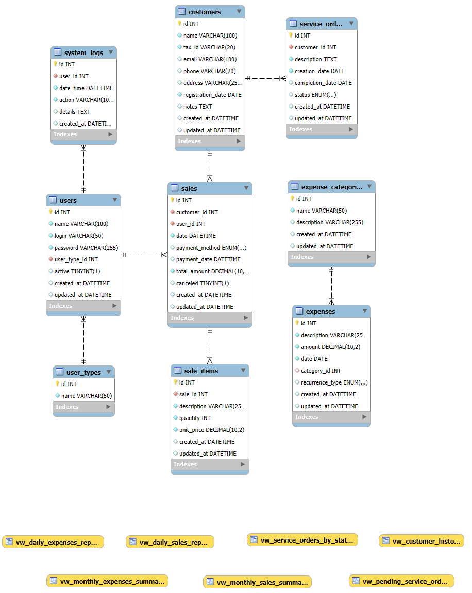

# SalesSync

<p align="center">
  
  
  
</p>

## Sobre o Projeto

**Projeto Integrador - Senac ETAPA 6 (Refatoração)**. 

O SalesSync é um sistema de gestão de vendas e serviços desenvolvido para pequenos negócios. O sistema permite o controle de vendas, ordens de serviço, despesas e clientes, oferecendo uma solução completa para a gestão financeira e operacional do negócio.

## Funcionalidades

- **Gestão de Vendas**: Registro e acompanhamento de vendas, com suporte a diferentes métodos de pagamento
- **Ordens de Serviço**: Criação e gerenciamento de ordens de serviço com acompanhamento de status
- **Gestão de Clientes**: Cadastro completo de clientes com histórico de compras e serviços
- **Controle de Despesas**: Registro e categorização de despesas, com suporte a recorrências
- **Relatórios Financeiros**: Balanços diários, mensais e anuais para análise financeira
- **Controle de Acesso**: Diferentes níveis de acesso para administradores, proprietários e funcionários
- **Logs de Sistema**: Registro completo de atividades para auditoria e segurança

## Tecnologias Utilizadas

- **Backend**: Java 17 com JPA/Hibernate 6.2
- **Frontend**: Swing com FlatLaf 3.1 (Look and Feel moderno)
- **Banco de Dados**: MySQL 8.0
- **Segurança**: BCrypt para hash de senhas
- **Ferramentas**: Maven para gerenciamento de dependências

## Requisitos de Sistema

- Java 17 ou superior
- MySQL 8.0 ou superior
- Mínimo de 4GB de RAM
- 100MB de espaço em disco para a aplicação

## Instalação

### Pré-requisitos

- JDK 17+
- MySQL 8.0+
- Maven

### Passos para Instalação

1. Clone o repositório:
```bash
git clone https://github.com/seu-usuario/sales-sync.git
cd sales-sync
```

2. Configure o banco de dados:

- Instale o banco de dados:
```bash   
src/main/resources/db/script.sql
```
- Insira os dados iniciais do sistema:
```bash
src/main/resources/db/data.sql
```
- Configure as credenciais do banco de dados: 

```bash
src/main/resources/META-INF/persistence.xml
```
    
3. Compile o projeto:

```bash
mvn clean package
```

4. Execute a aplicação:

```bash
java -jar target/salessync-1.0-SNAPSHOT.jar
```

## Estrutura do Projeto

```
sales-sync/
├── src/
│   ├── main/
│   │ 
│   │   ├── java/br/com/devjf/salessync/
│   │   │   ├── controller/    # Controladores da aplicação
│   │   │   ├── dao/           # Camada de acesso a dados
│   │   │   ├── model/         # Entidades e modelos de dados
│   │   │   ├── service/       # Lógica de negócio
│   │   │   └── util/          # Classes utilitárias
│   │   │   
│   │   └── resources/
│   │       ├── db/            # Scripts SQL
│   │       ├── images/        # Imagens e ícones
│   │       └── META-INF/      # Configuração JPA
│   │ 
│   └── test/                  # Testes unitários e de integração
│   
└── doc/                       # Documentação
```

## Uso

### Login Inicial

- Usuário : admin
- Senha : @devjf123admin

### Principais Telas

1. Dashboard : Visão geral do negócio com indicadores principais
2. Vendas : Registro e consulta de vendas
3. Ordens de Serviço : Gerenciamento de serviços
4. Clientes : Cadastro e histórico de clientes
5. Despesas : Controle de gastos
6. Relatórios : Análises financeiras e operacionais
7. Configurações : Ajustes do sistema e usuários

## Relatórios Disponíveis

- Balanço diário
- Balanço mensal
- Balanço anual
- Ordens de serviço por status
- Análise de lucro

## Desenvolvimento

### Dependências Principais

- Hibernate ORM 6.2.7.Final
- Jakarta Persistence 3.1.0
- MySQL Connector 8.0.33
- JBCrypt 0.4
- Apache Commons Lang 3.12.0
- JUnit 4
- mockito-core-4.11.0
- objenesis-3.3
- byte-buddy-agent-1.14.4
- byte-buddy-1.14.4

### Compilação

O projeto utiliza Maven para gerenciamento de dependências e build:

```bash
mvn clean install
```
## Licença

Este projeto está licenciado sob a licença MIT - veja o arquivo LICENSE para detalhes.

## Contato

©DevJF - djfcoder@outlook.com
